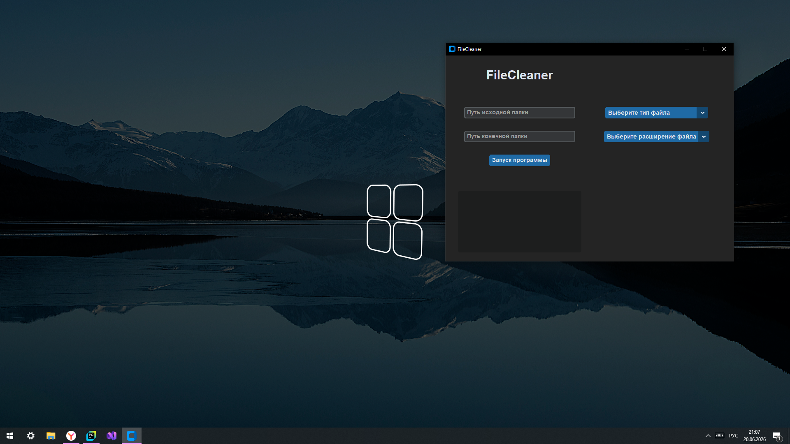

# FileCleaner (Russian Version)

FileCleaner - это программа для упорядочивания и распределения файлов с указанными 
расширениями по нужным папкам вашего компьютера.

---
## Что нового?
- Улучшен пользовательский интерфейс
- Улучшена система выбора номера с нужным расширением файла без вывода системной ошибки.
- Оптимизирован код. Удален лишний мусор.

## Чего ожидаем нового?
- Больше функций и возможностей.
- Адаптивность к разным операционным системам.
- Исправление ошибок.
- Доработка графического интерфейса.

## Как все работает?
1. Вы указываете две папки: начальную и конечную.
2. Вы указываете какие файлы нужно отправить (текст, фотографии, видео, музыка).
3. Выбираете расширение файла по выбранному типу.
4. Подтверждаете действие.
5. Получаете результат.
---
Создатель: **Vladi Akopyan**

[Телеграмм канал разработчика](https://t.me/ProtocolGhostStudio)

Версия: **Beta 1.1**
